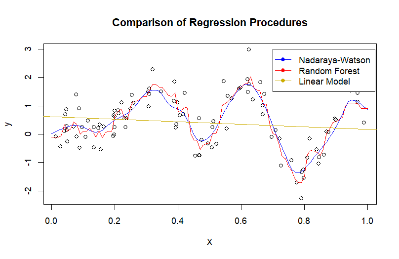

# Project: The Asymptotics of Cross-Validation and Aggregation in Regression

This repository contains the LaTeX report and simulation code for a project exploring model selection and aggregation in regression, with a focus on the asymptotic properties of cross-validation methods. The report investigates both parametric (linear) and nonparametric settings, and discusses aggregation as an alternative to model selection. It draws heavily on foundational results from the sources listed in `latex/citations.bib`, and includes original derivations, discussion, and simulation design. This project was completed as part of coursework for McGill's MATH 410.

**Date:** April 16, 2025  
**Author:** Diego Urdapilleta de la Parra  
**Supervisor:** Professor Mehdi Dagdoug

## Contents

- `report.pdf`: Final written report.
- `slides.pdf`: Presentation slides used to summarize the project.
- `code/`: Contains R scripts for simulations supporting some of the theoretical results.
- `latex/`: Contains LaTex source code for the compilation of the report and slides.

## License

This work is shared under the MIT License.

